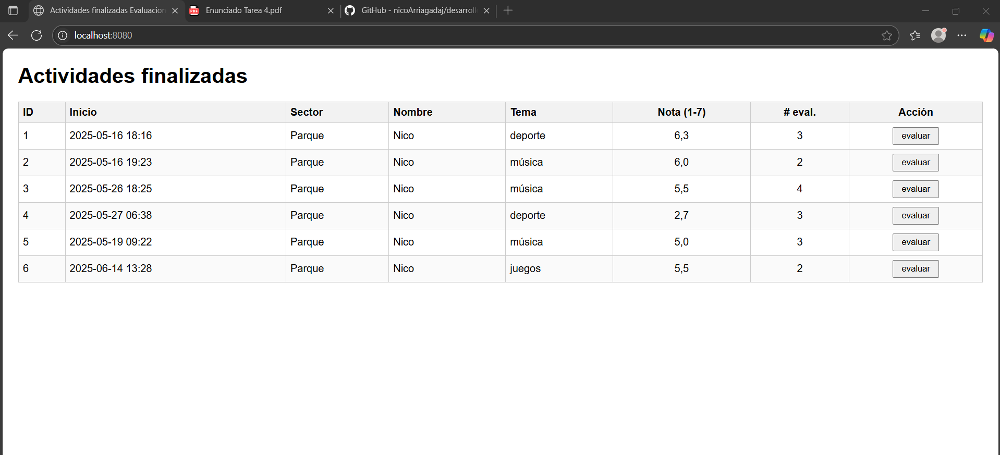
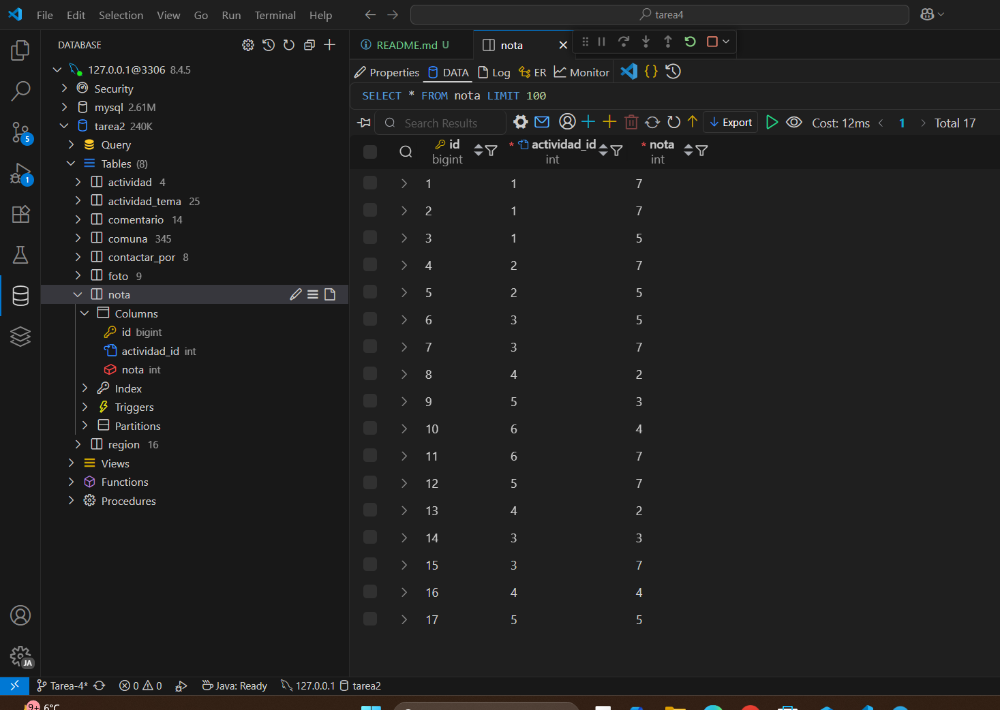

# Datos relevantes del proyecto
## Esta pagina web ha sido testeada en Microsoft Edge
#### cualquier duda contactar: Nicolás 

  
  
  

Notemos lo sgte:
Se ha hecho run a [Tabla-notaSQL](src/main/resources/tabla-nota.sql) con la base de datos que teníamos en la tarea 2 y 3, por ende, tenemos los mismos datos conectados + la tabla de notas, que es la novedad de esta tarea4.
dado el link http://localhost:8080/ que tenemos al correr el programa:
[Para correr el programa](src/main/java/com/example/tarea4/Tarea4Application.java)
tenemos los siguientes resultados:

Y se ha podido, calcular el promedio, de las notas ingresadas en la tabla notas.